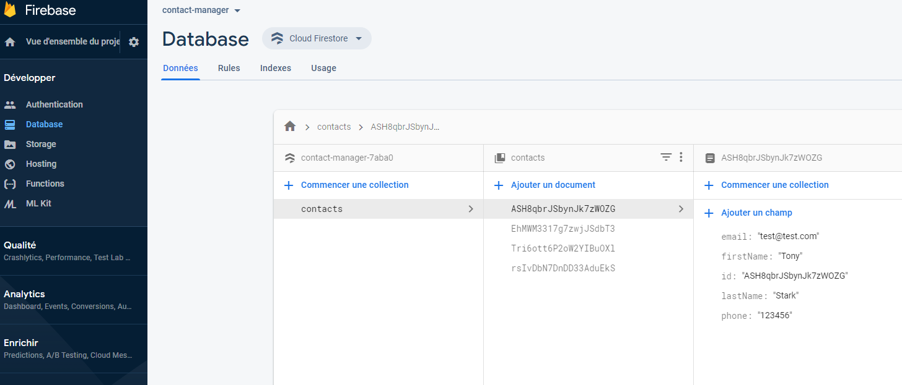

# Vue.js and Google Cloud Firestore: Contact Manager

*April 2020*

> 🔨 Contact Manager (CRUD) using Google Cloud Firestore to store datas. From Udemy '[Créer une Single Page Application avec Vue.js et Firestore](https://www.udemy.com/course/creer-une-single-page-application-avec-vuejs-et-firestore)'.




## About

Contact manager with CRUD to store contact data in Cloud Firestore.

**Components:**
- ContactForm: manages creation of contact
- ContactList:  manages delete and edit contact
- ContactDetails: manages displaying contact card (view mode and edit mode)

**Views**

- Home: manages the displaying of all the cards and the promises returned by db.js
(that manages communication with Firestorm).

## How to use?

### Localy

Clone, the [local-version](https://github.com/Raigyo/vue-contact-manager/tree/local-version) branch.

Then:

```
npm install
npm run serve
```

### Online

See demo on [Heroku](#).

**During development**

Problem with spaces using Eslint, use: `npm run lint -- --fix`

Also put your pages in *LF* (=Line Feed) instead of *CR+LF* (=Carriage Return + Line Feed)

**Compiles and minifies for production**

`npm run build`

**Useful snipets**

`vbase`

`vimport`

`vmethod`

`vdata`

## Components

- [Firebase](https://www.npmjs.com/package/firebase)
- [vue-router](https://www.npmjs.com/package/vue-router)

## Usefull links

- [Udemy: Créer une Single Page Application avec Vue.js et Firestore](https://www.udemy.com/course/creer-une-single-page-application-avec-vuejs-et-firestore)
- [Udemy: repo Github codeconcept/contact-manager](https://github.com/codeconcept/contact-manager)
- [VSCode: Vue VSCode Snippets](https://marketplace.visualstudio.com/items?itemName=sdras.vue-vscode-snippets)
- [VSCode: Trailing Spaces](https://marketplace.visualstudio.com/items?itemName=shardulm94.trailing-spaces)